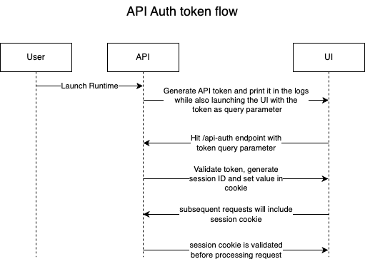

# API Token Authentication

Author(s): @decleaver  
Date Created: Sept 17, 2024  
Status: APPROVED

### Problem Statement
API authentication is needed to prevent unauthorized access to the API from other processes when running UDS Runtime locally.

### Implementation Details
The API uses a token-based authentication system. The token is generated by the backend server and is used to authenticate the user. API authentication is enabled by default, to disable it you can set the `API_AUTH_DISABLED` environment variable to true.

Instead of managing state in the frontend, the api authentication state is managed in the backend. One way this can be accomplished is by using session cookies.

The generated api token is used initially by the frontend to authenticate with the backend, but once the token is validated, the backend generates a session ID and sets the session ID as a secure, HttpOnly cookie in the response. The frontend receives the response and the browser automatically stores the session cookie. For subsequent requests, the browser automatically includes the session cookie and the backend authMiddleware extracts and validate the session ID from the cookie. This approach simplifies the frontend codebase and reduces the amount of state management needed in the frontend.

How does the frontend authenticate?
- Backend generates a token when it is started up and launches UDS Runtime in the browser.
    - i.e.(Runtime API connection: `http://127.0.0.1:8080?token=r1hrQ9CcuZMKpY2egjsPrzmge3-YqfqOHjmlIOvdKrLGOLnHPgFWt3dzsdkHwzDdXQAfRRHiH~rbGEx7Jc7rTxTd4riCuqGH`)
- Frontend hits the /api-auth endpoint with the token as a query parameter.
- The backend validates the token and generates a session ID and sets it in a cookie.
- Subsequent requests will include the session cookie and the backend will validate the session ID before processing any requests.
  

The session cookie is valid for the duration of the browser session and is deleted when the browser is closed.

  

### Alternatives Considered
#### Manage authentication state in the frontend
Instead of managing the API authentication state on the backend, it can be managed on the frontend. In this approach, when a user is authenticated, the token is stored in `sessionStorage` and remains valid for the duration of the page session. This token is then used when creating the `EventSources` for various views. Reauthentication can be done by hitting the `/auth` endpoint with the token as a query parameter. While this method simplifies the backend codebase, it increases the complexity of the frontend codebase. The frontend must determine if API authentication is enabled and if the user is authenticated, all while maintaining the current state using Svelte stores and `sessionStorage`.
